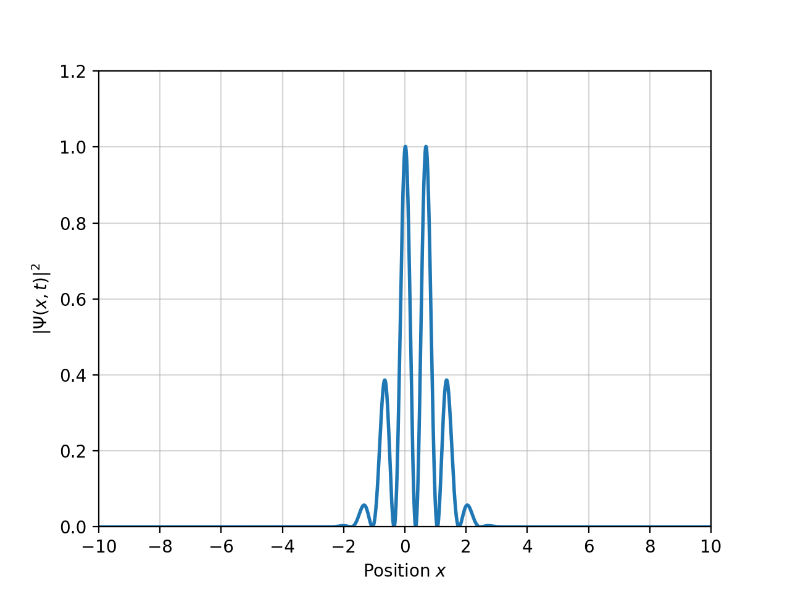

# Quantum Harmonic Oscillator - 1D, 2D & 3D Dynamic Simulation

$$ V(\mathbf{r}) = \frac{1}{2} M \omega^2 r^2 $$

  
  

# Acknowledgements
Many thanks to Prof. [Julio César Gutiérrez-Vega](https://scholar.google.com/citations?user=SXtXBWkAAAAJ&hl) for his guidance in this project.
